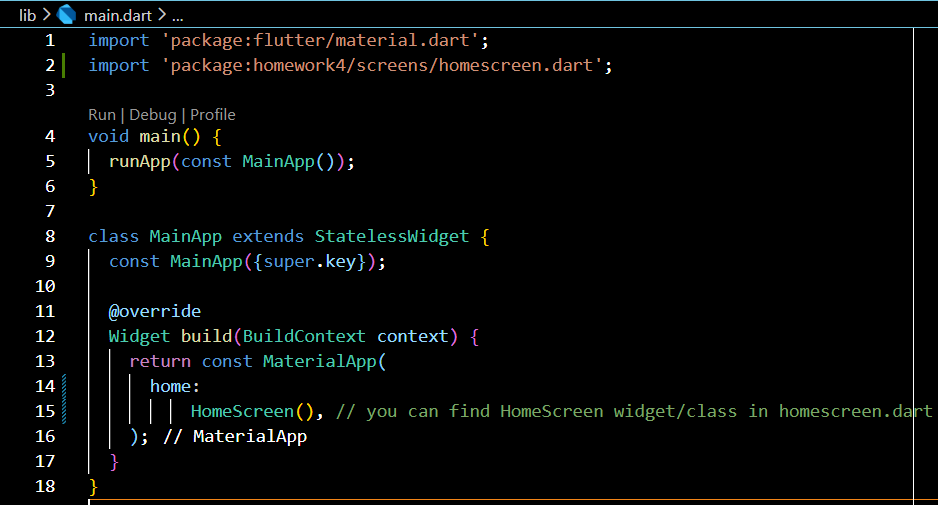
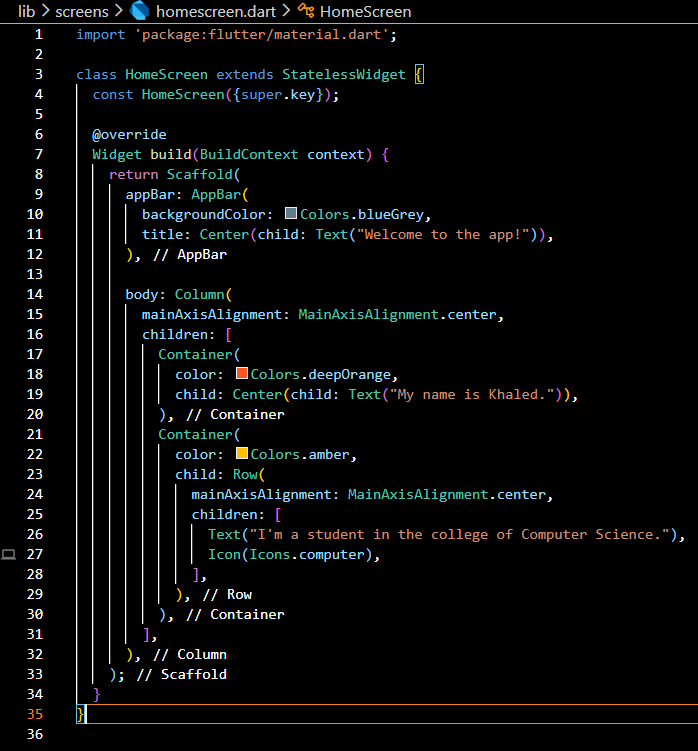
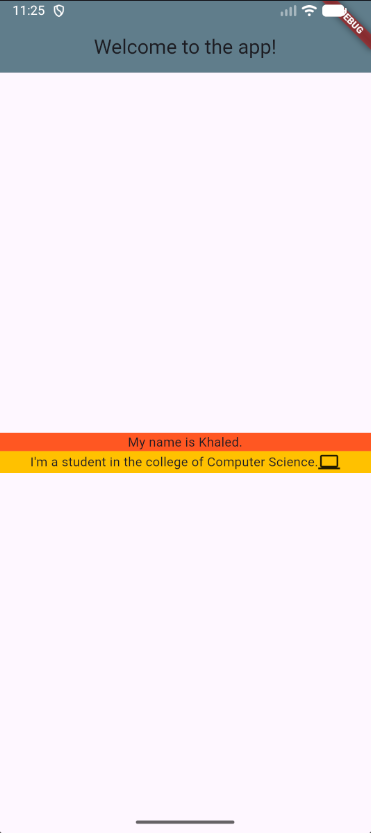

# Homework 4

**This homework involves adding a screen which contains AppBar, Column, Row, Container, Axis Alignment and Text.**

*Picture of main.dart:*

 

*Picture of homescreen.dart*

 

*Picture of the UI:*

